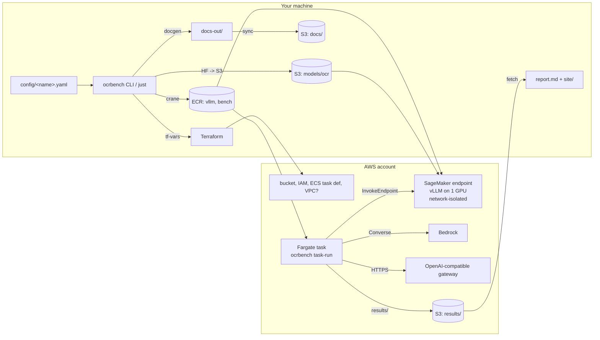

# Architecture

## Components

| Component | Role | Notes |
|---|---|---|
| `docgen` | HTML → PDF (headless Chrome) → PNG (pdfium), plus a degraded "photo" variant | Ground truth comes from the same calls that write the HTML, so the two can't drift |
| SageMaker endpoint | Serves the OCR model with vLLM's OpenAI server (`/ping` and `/invocations` on :8080) | Container runs network-isolated; SageMaker mounts weights from S3 at `/opt/ml/model` |
| Fargate runner | Runs both stages inside the VPC | Needed when backends are only reachable privately; otherwise use `runner.mode: local` |
| Backends | One interface: `complete(Request) -> Response` | Runners don't know which provider they're talking to |
| Scorer | Page metrics, field accuracy, latency and cost aggregates | Pure function of the files in `results/<tag>/` |
| Site | Static HTML, no external resources | Open via `file://` or zip it |

## Two-stage evaluation

Stage 1 shows how well each backend **reads**. Stage 2 is closer to how a document
pipeline would use OCR: an agent extracts per-type fields such as totals, dates, account
numbers and checked boxes, and the result is scored field by field. Pipelines:

- `ocr->agent`: the self-hosted model reads, then the LLM extracts from the text (cheap input, two hops).
- `<llm>->agent`: the same, with an LLM transcript.
- `image->agent`: the LLM extracts straight from the images (one hop, image-token cost).

End-to-end latency for `X->agent` is the sum of X's per-page latencies (concurrency-1 runs
preferred) plus the agent call. Cost adds X's per-page cost (for the OCR model, GPU hourly
price ÷ measured throughput).

## Why these choices

- **SageMaker instead of an EC2 GPU box.** Managed hosts, scale to zero by deleting the
  endpoint, and they work in accounts that restrict EC2 AMIs. Instance pools cope with
  scarce GPU capacity.
- **crane instead of docker.** Works on machines without a Docker daemon and with corporate
  proxies. A layer append is seconds, and the 9 GB base image is copied registry-to-registry
  once.
- **Weights in S3, pinned revision and SHA-256.** The endpoint needs no internet access, and
  the exact model bytes are auditable through `models/ocr.manifest.json`.
- **One config feeding Terraform.** Redeploying to another account means writing another
  YAML file; no code or `.tf` edits.
